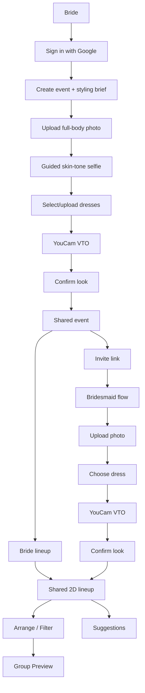

# Vows & Vibe

**See it. Style it. Love it.**

Vows & Vibe is a collaborative bridal-party styling app that helps a bride and her bridal party try on dresses virtually, coordinate colors, share feedback, and see confirmed looks together before the wedding.

**Live Demo:** https://vowsvibe-one.vercel.app

## What It Does

- Virtual dress try-on with Perfect Corp YouCam
- Guided skin-tone selfie capture with Camera Kit
- Color-aware dress analysis and palette matching
- Invite-based bridesmaid flow with no account required
- Shared interactive 2D bridal-party lineup
- Participant-to-participant styling suggestions
- AI-generated venue group previews with Qwen Image
- PNG export and saved lineup state

## How It Works

### Bride & Bridesmaids

Both the bride and bridesmaids can upload a full-body photo, take a guided skin-tone selfie, try dresses virtually, review color-analysis guidance, generate multiple VTO attempts, and confirm a final look.

### Bride-Only Features

- Signs in with Google
- Creates and manages the event
- Sets the styling brief: dress length, fabric, color palette, and example dresses
- Invites bridesmaids
- Arranges confirmed looks in the shared lineup studio
- Filters the lineup by Palette Match, Family Match, and Other
- Saves and exports the lineup
- Generates and saves AI group previews

## Key Features

### Virtual Try-On & Skin-Tone Analysis

Users upload a full-body photo for dress visualization and a separate guided selfie for personalized color analysis.

Perfect Corp's Clothes Virtual Try-On API (`cloth-v4`) generates dress previews, while the YouCam Skin Tone Analysis flow provides skin and hair-color hex values, used by the app's styling guidance.

VTO attempts are stored through the `vto_attempts` model so users can revisit previous renders without losing progress. The guided selfie is analyzed without being stored; only the derived color-analysis values are saved.

### Bride Compose Studio

Confirmed participants appear in a shared Fabric.js canvas where the bride can arrange the group visually.

- Drag and reposition participants
- Filter the lineup by color relationship
- Save the lineup, which is then shown to bridesmaids via Supabase Realtime events
- Export the bride's current composition as PNG
- Share participant-to-participant suggestions

### Color Coordination

Each confirmed dress belongs to one of three mutually exclusive groups:

- **Palette Match** — exact normalized match to one of the bride's selected palette colors
- **Family Match** — a non-exact shade in the same broad color family that falls within the configured perceptual-distance threshold
- **Other** — includes two subcategories:
  - **Related Shade:** a color from the same family as the palette, but too perceptually different to qualify as a Family Match
  - **Different Family:** a custom color that falls outside the bride's selected palette families

Dress colors are converted to **CIE Lab**, and **CIEDE2000 (ΔE00)** is used when perceptual color difference is the relevant measurement, such as finding the nearest palette shade.

Dress compatibility is calculated separately using undertone, lightness, chroma, and available skin-to-hair contrast signals. The result is presented as styling guidance rather than a scientific or definitive recommendation.

### AI Group Preview

The bride can upload a venue image, arrange confirmed participant cutouts, choose finishing presets, and generate a polished wedding-party preview with Alibaba Cloud Model Studio's Qwen Image API.

Generated previews can be downloaded and optionally saved for the bridal party's public lineup view.

## Workflow



## Tech Stack

- **Framework:** Next.js 16, React 18, TypeScript
- **Backend / Auth / Database:** Supabase — Postgres, Auth, Storage, Realtime
- **Virtual Try-On / Skin Analysis:** Perfect Corp YouCam APIs
- **AI Group Preview:** Alibaba Cloud Model Studio / Qwen Image
- **Canvas:** Fabric.js 6.7.1
- **Background Removal:** `@imgly/background-removal-node`
- **Validation:** Zod

## Local Development

### Prerequisites

- Node.js 22
- Supabase project
- Perfect Corp / YouCam API key
- Groq API key
- Alibaba Cloud Model Studio workspace and API key for group previews
- Google OAuth client for Supabase Auth

### 1. Install

```bash
git clone
cd vows-and-vibe
npm install
```

### 2. Configure Environment Variables

Create `.env.local` from `.env.example` and fill in your own values.

### 3. Configure Supabase

1. Run `supabase/schema.sql` in the Supabase SQL Editor.
2. Confirm the required `vto-renders` Storage bucket exists.
3. Enable Google OAuth in Supabase Auth.
4. Add this local callback URL:

```text
http://localhost:3000/auth/callback
```

### 4. Run

```bash
npm run dev
```

Open `http://localhost:3000`.

To verify a production build locally:

```bash
npm run build
```

## Live Deployment

The deployed app is available on Vercel:

**https://vowsvibe-one.vercel.app**

## Repository Structure

```text
src/
├── app/
│   ├── api/               # VTO, events, participants, upload endpoints
│   ├── auth/              # OAuth callback
│   ├── dashboard/         # Bride event dashboard
│   ├── events/            # Event dashboard, style, lineup
│   ├── invite/            # Public bridesmaid invite entry
│   └── login/             # Google sign-in
├── components/
│   ├── BridalLookStudio.tsx
│   ├── BridesmaidFlow.tsx
│   ├── EventForm.tsx
│   ├── LineupCanvas.tsx    # Fabric.js bridal-party canvas
│   ├── SelfieUpload.tsx    # Guided capture + upload fallback
│   └── SuggestionTools.tsx
├── lib/
│   ├── color/             # Undertone and dress compatibility logic
│   ├── cutout/            # Image background removal
│   ├── storage/           # Supabase Storage helpers
│   ├── supabase/          # Browser/server clients
│   └── youcam/            # Perfect Corp API integration
└── proxy.ts               # Supabase auth session refresh
```

## Note on Color Analysis

Color analysis is intended as guidance, not a strict rule. Lighting, camera accuracy, fabric, surroundings, personal preference, and styling choices can all affect how a color appears in practice.
